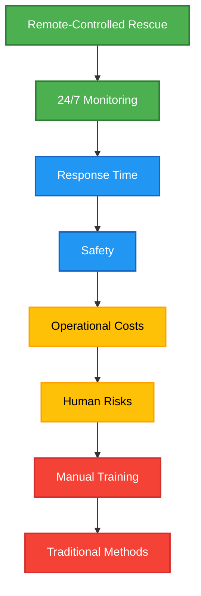
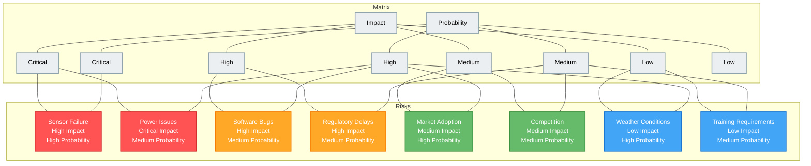
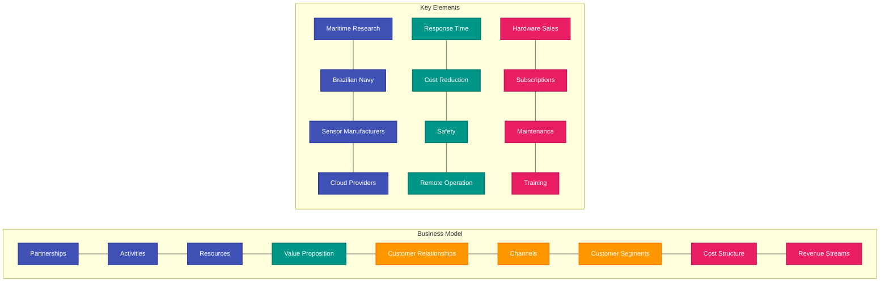
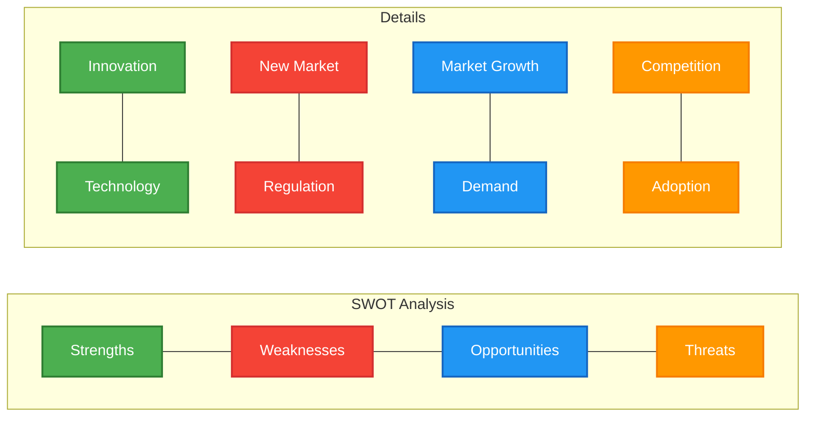
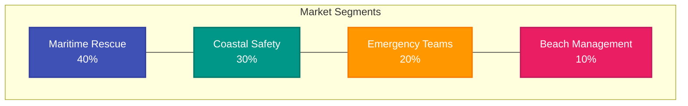
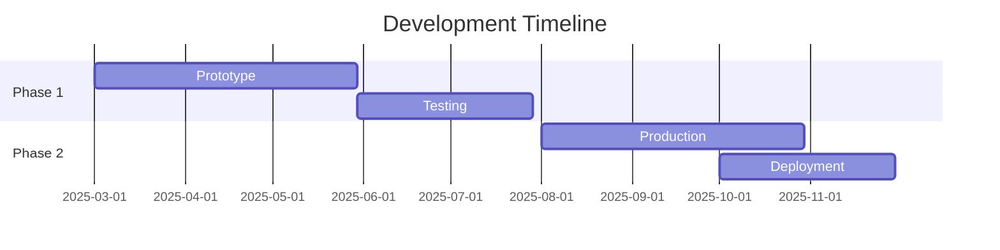
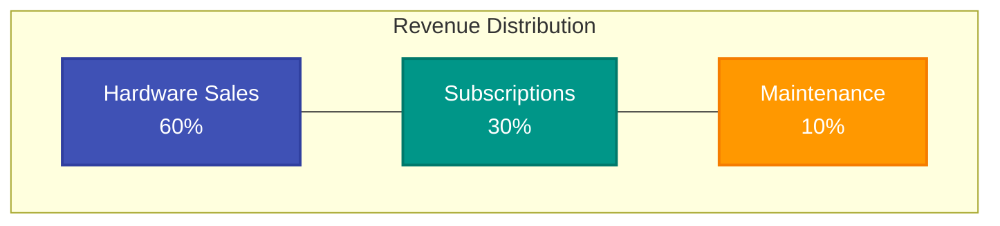
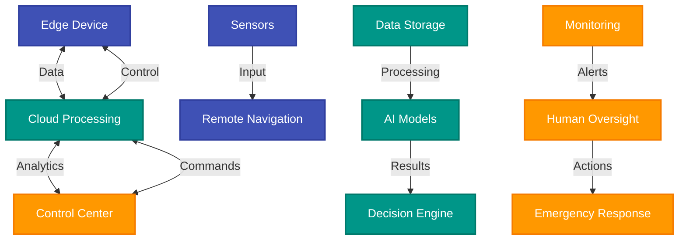
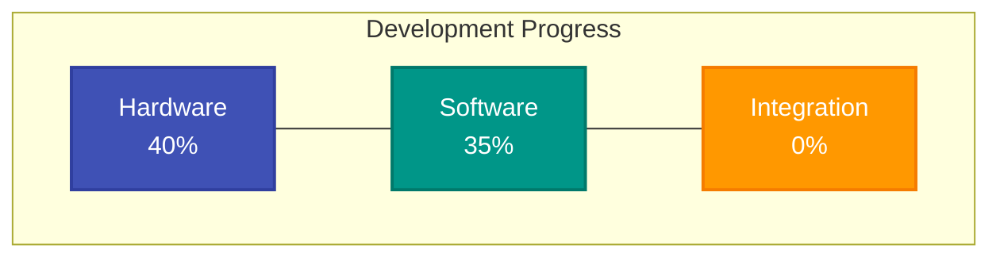
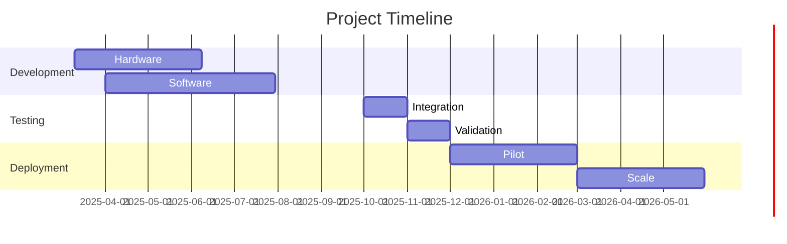

# Nautic.AI - Public Development Report (v2)

## Executive Summary

Nautic.AI is an innovative maritime rescue solution designed to drastically reduce emergency response times. This second report version summarizes the main development achievements of the current module, with a focus on hardware prototyping,  documentation, and software architecture. The buoy is guided by remote control via transmitter, ensuring precise and responsive operation during rescue missions.

**Key updates in this version:**
- Improved documentation and organization of SolidWorks and Arduino files, now clearly marked as backup and referenced in the project structure.
- Enhanced MVP documentation, including images and technical details of the turbine and motor, plus a more robust technical development plan.
- Updated progress metrics and technical architecture reflecting the latest sprint.

---

## 1. Blue Ocean Strategy

The diagram below illustrates our innovation strategy, divided into four quadrants:
- **Create**: New features introduced by Nautic.AI (e.g., remote-controlled rescue buoy)
- **Increase**: Aspects we are enhancing
- **Reduce**: Elements we are minimizing
- **Eliminate**: Features removed from traditional models

---

## 2. Risk Matrix

This diagram classifies the main project risks into four levels:
- **Critical**: Requires immediate action
- **High**: Needs constant monitoring
- **Medium**: Needs mitigation plans
- **Low**: Can be managed routinely

---

## 3. Business Model Canvas

The diagram below summarizes the nine key elements of our business model:
- **Partnerships**: Who helps us deliver value
- **Activities**: What we do to create value
- **Resources**: What we need to operate
- **Value Proposition**: What we offer to customers
- **Customer Relationships**: How we interact with customers
- **Channels**: How we deliver value
- **Customer Segments**: For whom we create value
- **Cost Structure**: What we spend to operate
- **Revenue Streams**: How we make money

---

## 4. SWOT Analysis

This diagram presents our strengths, weaknesses, opportunities, and threats:
- **Strengths**: What we do well
- **Weaknesses**: What we need to improve
- **Opportunities**: What we can leverage
- **Threats**: What could negatively affect us

---

## 5. Business Plan

### 5.1. Market Overview

Market segmentation:
- **Maritime Rescue**: 40%
- **Coastal Safety**: 30%
- **Emergency Teams**: 20%
- **Beach Management**: 10%

### 5.2. Financial Projections

Development timeline:
- **Phase 1**: Prototype and testing
- **Phase 2**: Production and deployment

### 5.3. Revenue Streams

Revenue distribution:
- **Hardware Sales**: 60%
- **Subscriptions**: 30%
- **Maintenance**: 10%

---

## 6. Technical Architecture

System component communication:
- **Edge Device**: Hardware with sensors and local processing, guided by remote control
- **Cloud Processing**: Data processing and decision-making
- **Control Center**: Human monitoring and intervention

---

## 7. Development Status

### 7.1. Progress Overview

**Documentation and File Organization:**  
- All SolidWorks and Arduino files are now clearly marked as backup only, with README files in their respective directories.  
- MVP documentation expanded, including images and technical details of the turbine and motor, and a more detailed prototype breakdown.

**MVP and Prototype:**  
- Dedicated section for turbine and motor, with images and technical details.
- Physical prototype progressing: buoy, turbine, and motor models available and referenced in documentation.

**Softwar:**  
- Software stack and  pipeline documented, with progress in simulation and initial real-world tests.

**Progress Metrics:**
- **Hardware**: 40% complete
- **Software**: 35% complete
- **Integration**: 20% complete

### 7.2. Timeline
The Gantt chart shows our detailed schedule:
- **Development**: Hardware and software
- **Testing**: Integration and validation
- **Deployment**: Pilot and scale

---

## 8. Conclusion

Nautic.AI is a breakthrough in maritime rescue, combining advanced technology with a sustainable business model. The current development phase has established a strong foundation for future success, focusing on:

1. Technological innovation in remote-controlled rescue
2. Significant reduction in operational costs
3. Increased safety for rescue teams
4. Scalable and sustainable business model

**Next Steps:**  
The next module will be crucial for project validation and implementation, focusing on:
- Completion of technical development
- System integration
- MVP validation (with all key components, including turbine and motor, documented and tested)
- Regulatory certification and compliance
- Implementation of pilots with strategic partners

--- 