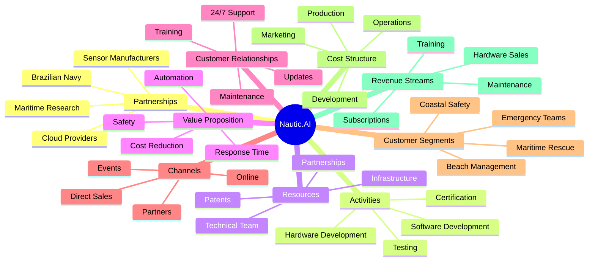
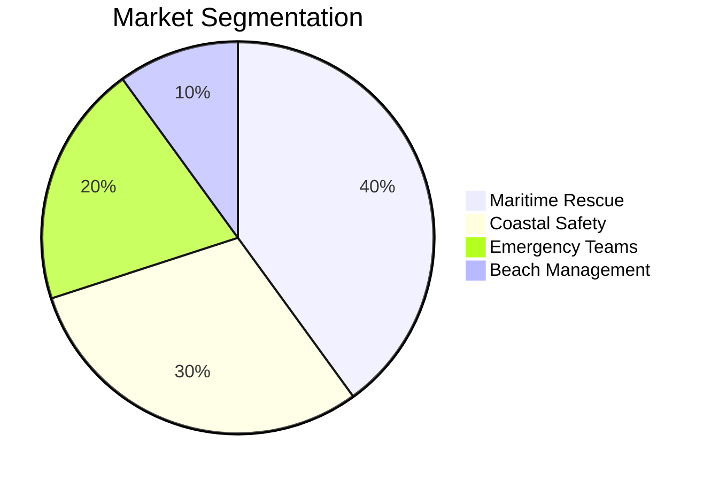
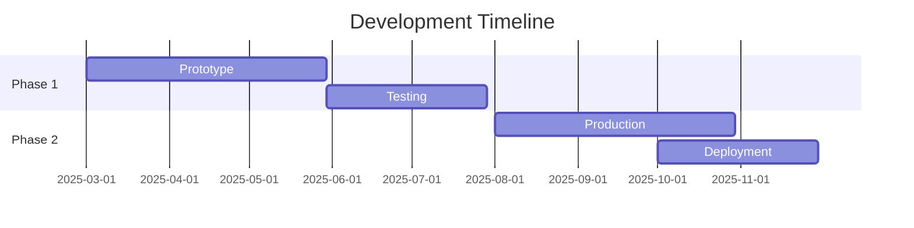
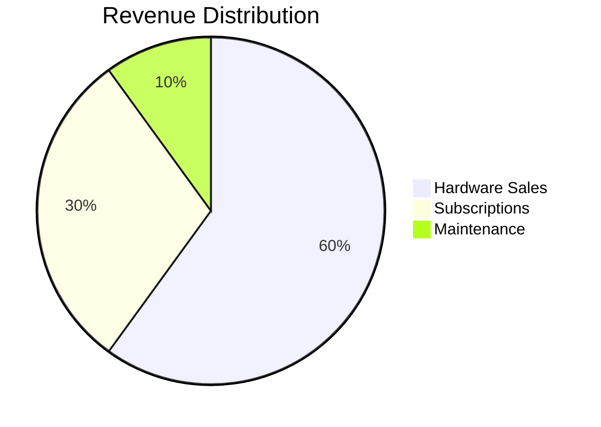
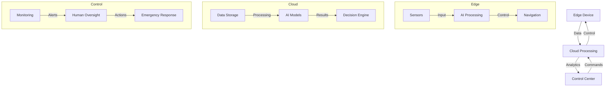
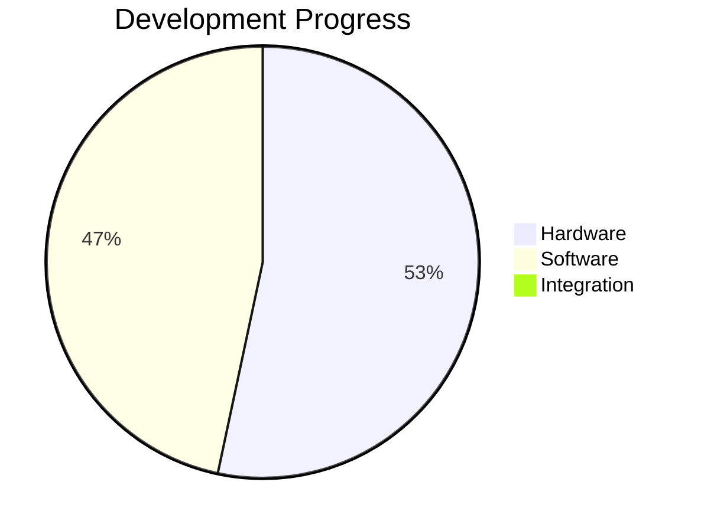
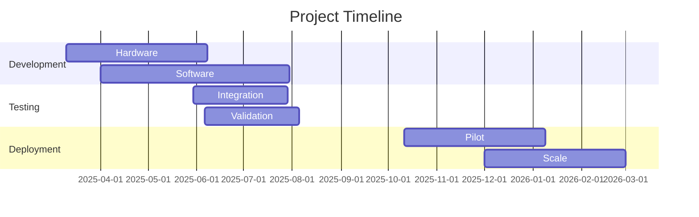

# Nautic.AI - Public Development Report

## Executive Summary

Nautic.AI is an innovative autonomous maritime rescue solution designed to significantly reduce response times in emergency situations. This report summarizes the development work completed during the current module.

The module was dedicated to hardware prototyping in SolidWorks, business development, and software structuring for the autonomous model.

## 1. Blue Ocean Strategy

The diagram below shows our innovation strategy, divided into four quadrants:
- **Create**: New unique features of Nautic.AI
- **Increase**: Aspects we are improving
- **Reduce**: Elements we are minimizing
- **Eliminate**: Features we removed from the traditional model

```mermaid
quadrant-chart
    title Blue Ocean Strategy - Nautic.AI
    x-axis Low High
    y-axis Low High
    quadrant-1 Create
    quadrant-2 Increase
    quadrant-3 Reduce
    quadrant-4 Eliminate
    Autonomous Rescue: [0.8, 0.9]
    24/7 Monitoring: [0.9, 0.8]
    Operational Costs: [0.2, 0.3]
    Human Risks: [0.1, 0.2]
    Response Time: [0.3, 0.2]
    Manual Training: [0.2, 0.1]
```

## 2. Risk Matrix

This diagram classifies the main project risks into four levels:
- **Critical**: Risks requiring immediate attention
- **High Risk**: Requiring constant monitoring
- **Medium Risk**: Needing mitigation plans
- **Low Risk**: Can be managed normally

```mermaid
quadrant-chart
    title Risk Matrix - Nautic.AI
    x-axis Low High
    y-axis Low High
    quadrant-1 Critical
    quadrant-2 High Risk
    quadrant-3 Low Risk
    quadrant-4 Medium Risk
    Sensor Failure: [0.7, 0.8]
    Software Bugs: [0.6, 0.7]
    Power Issues: [0.5, 0.9]
    Market Adoption: [0.8, 0.6]
    Regulatory Delays: [0.7, 0.7]
    Competition: [0.4, 0.5]
```

## 3. Business Model Canvas

The mind map below represents the nine essential elements of our business model:
- **Partnerships**: Who helps us deliver value
- **Activities**: What we do to create value
- **Resources**: What we need to operate
- **Value Proposition**: What we offer to customers
- **Customer Relationships**: How we interact with customers
- **Channels**: How we deliver value
- **Customer Segments**: For whom we create value
- **Cost Structure**: What we spend to operate
- **Revenue Streams**: How we make money



## 4. SWOT Analysis

This diagram shows our analysis of strengths, weaknesses, opportunities, and threats:
- **Strengths**: What we do well
- **Weaknesses**: What we need to improve
- **Opportunities**: What we can leverage
- **Threats**: What could negatively affect us

```mermaid
quadrant-chart
    title SWOT Analysis - Nautic.AI
    x-axis Internal External
    y-axis Negative Positive
    quadrant-1 Opportunities
    quadrant-2 Strengths
    quadrant-3 Weaknesses
    quadrant-4 Threats
    Market Growth: [0.8, 0.8]
    Innovation: [0.2, 0.8]
    New Market: [0.2, 0.2]
    Competition: [0.8, 0.2]
```

## 5. Business Plan

### 5.1. Market Overview
The pie chart shows how the market is segmented:
- **Maritime Rescue**: 40% of the market
- **Coastal Safety**: 30% of the market
- **Emergency Teams**: 20% of the market
- **Beach Management**: 10% of the market



### 5.2. Financial Projections
The Gantt chart shows our development timeline:
- **Phase 1**: Prototype and testing
- **Phase 2**: Production and deployment



### 5.3. Revenue Streams
The pie chart shows how revenue is distributed:
- **Hardware Sales**: 60% of revenue
- **Subscriptions**: 30% of revenue
- **Maintenance**: 10% of revenue



## 6. Technical Architecture

The diagram below shows how system components communicate:
- **Edge Device**: The autonomous hardware with sensors and local processing
- **Cloud Processing**: Where data is processed and decisions are made
- **Control Center**: Where humans monitor and can intervene if necessary



## 7. Development Status

### 7.1. Progress Overview
The pie chart shows our current progress:
- **Hardware**: 40% complete
- **Software**: 35% complete
- **Integration**: 0% complete



### 7.2. Timeline
The Gantt chart shows our detailed schedule:
- **Development**: Hardware and software
- **Testing**: Integration and validation
- **Deployment**: Pilot and scale



## 8. Conclusion

Nautic.AI represents a significant innovation in the maritime rescue sector, combining advanced technology with a sustainable business model. The current development has established a solid foundation for future success, focusing on:

1. Technological innovation in autonomous rescue
2. Significant reduction in operational costs
3. Increased safety for rescue teams
4. Scalable and sustainable business model

The next module will be crucial for project validation and implementation, focusing on:
- Completion of technical development
- System integration
- MVP validation
- Regulatory certification and compliance
- Implementation of pilots with strategic partners