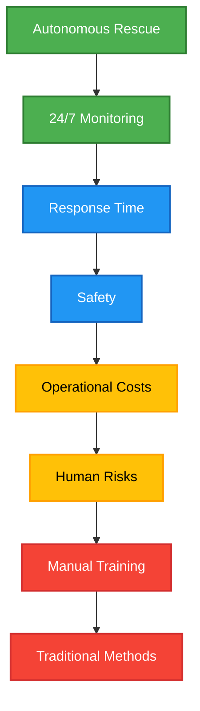
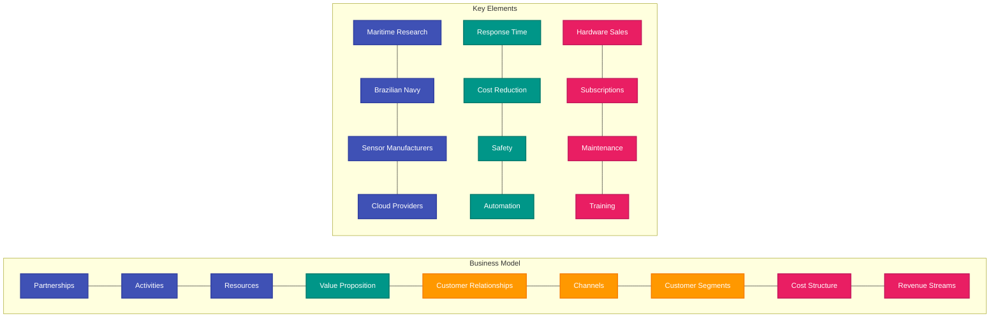
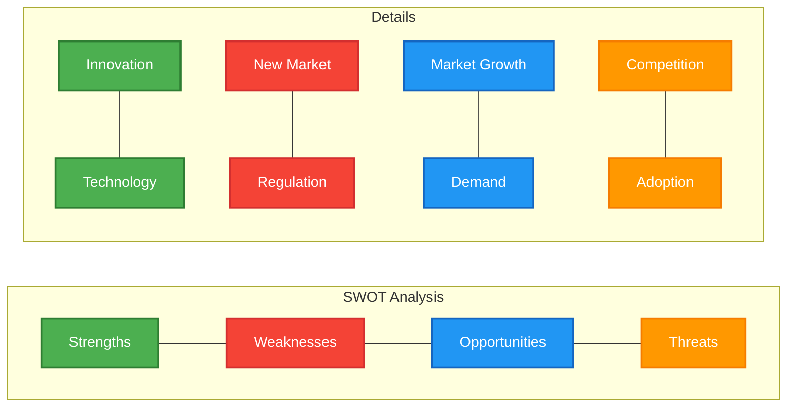
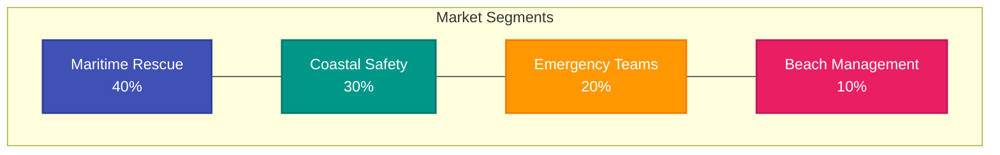
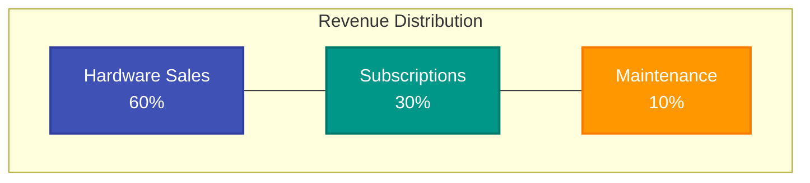
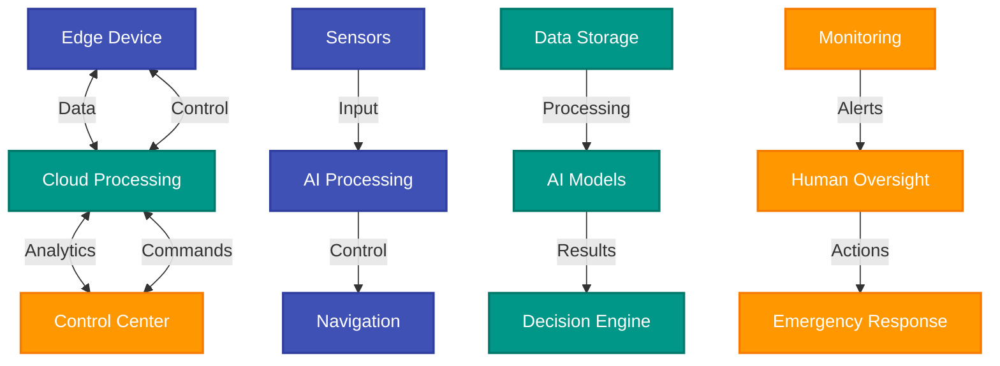
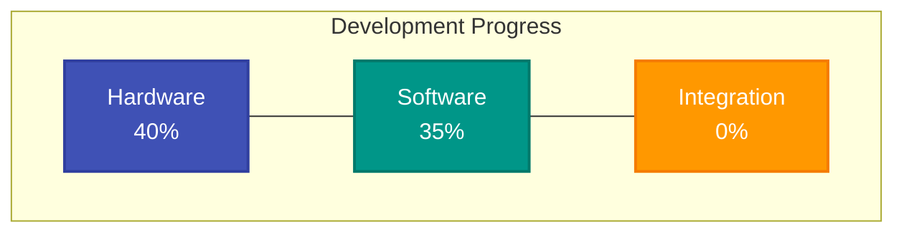

# Nautic.AI - Public Development Report

## Executive Summary

Nautic.AI is an innovative autonomous maritime rescue solution designed to significantly reduce response times in emergency situations. This report summarizes the development work completed during the current module.

The module was dedicated to hardware prototyping in SolidWorks, business development, and software structuring for the autonomous model.

## 1. Blue Ocean Strategy

The diagram below shows our innovation strategy, divided into four quadrants:
- **Create**: New unique features of Nautic.AI
- **Increase**: Aspects we are improving
- **Reduce**: Elements we are minimizing
- **Eliminate**: Features we removed from the traditional model

## 2. Risk Matrix

This diagram classifies the main project risks into four levels:
- **Critical**: Risks requiring immediate attention
- **High Risk**: Requiring constant monitoring
- **Medium Risk**: Needing mitigation plans
- **Low Risk**: Can be managed normally

```mermaid
graph TD
    classDef critical fill:#FF5252,stroke:#D32F2F,stroke-width:2px,color:white;
    classDef high fill:#FFA726,stroke:#F57C00,stroke-width:2px,color:white;
    classDef medium fill:#66BB6A,stroke:#388E3C,stroke-width:2px,color:white;
    classDef low fill:#42A5F5,stroke:#1976D2,stroke-width:2px,color:white;
    classDef axis fill:#ECEFF1,stroke:#90A4AE,stroke-width:2px,color:black;
    
    %% Matrix Structure
    subgraph Matrix
        direction TB
        Impact[Impact]:::axis
        Probability[Probability]:::axis
        
        %% Impact Levels
        Impact --- CriticalI[Critical]:::axis
        Impact --- HighI[High]:::axis
        Impact --- MediumI[Medium]:::axis
        Impact --- LowI[Low]:::axis
        
        %% Probability Levels
        Probability --- CriticalP[Critical]:::axis
        Probability --- HighP[High]:::axis
        Probability --- MediumP[Medium]:::axis
        Probability --- LowP[Low]:::axis
    end
    
    %% Risk Items
    subgraph Risks
        direction TB
        %% Critical Risks
        R1[Sensor Failure<br>High Impact<br>High Probability]:::critical
        R2[Power Issues<br>Critical Impact<br>Medium Probability]:::critical
        
        %% High Risks
        R3[Software Bugs<br>High Impact<br>Medium Probability]:::high
        R4[Regulatory Delays<br>High Impact<br>Medium Probability]:::high
        
        %% Medium Risks
        R5[Market Adoption<br>Medium Impact<br>High Probability]:::medium
        R6[Competition<br>Medium Impact<br>Medium Probability]:::medium
        
        %% Low Risks
        R7[Weather Conditions<br>Low Impact<br>High Probability]:::low
        R8[Training Requirements<br>Low Impact<br>Medium Probability]:::low
    end
    
    %% Connections
    CriticalI --- R1
    CriticalI --- R2
    HighI --- R3
    HighI --- R4
    MediumI --- R5
    MediumI --- R6
    LowI --- R7
    LowI --- R8
    
    CriticalP --- R1
    HighP --- R2
    HighP --- R3
    MediumP --- R4
    HighP --- R5
    MediumP --- R6
    HighP --- R7
    MediumP --- R8
```

## 3. Business Model Canvas

The diagram below represents the nine essential elements of our business model:
- **Partnerships**: Who helps us deliver value
- **Activities**: What we do to create value
- **Resources**: What we need to operate
- **Value Proposition**: What we offer to customers
- **Customer Relationships**: How we interact with customers
- **Channels**: How we deliver value
- **Customer Segments**: For whom we create value
- **Cost Structure**: What we spend to operate
- **Revenue Streams**: How we make money

## 4. SWOT Analysis

This diagram shows our analysis of strengths, weaknesses, opportunities, and threats:
- **Strengths**: What we do well
- **Weaknesses**: What we need to improve
- **Opportunities**: What we can leverage
- **Threats**: What could negatively affect us

## 5. Business Plan

### 5.1. Market Overview
The diagram shows how the market is segmented:
- **Maritime Rescue**: 40% of the market
- **Coastal Safety**: 30% of the market
- **Emergency Teams**: 20% of the market
- **Beach Management**: 10% of the market

### 5.2. Financial Projections
The Gantt chart shows our development timeline:
- **Phase 1**: Prototype and testing
- **Phase 2**: Production and deployment

### 5.3. Revenue Streams
The diagram shows how revenue is distributed:
- **Hardware Sales**: 60% of revenue
- **Subscriptions**: 30% of revenue
- **Maintenance**: 10% of revenue

## 6. Technical Architecture

The diagram below shows how system components communicate:
- **Edge Device**: The autonomous hardware with sensors and local processing
- **Cloud Processing**: Where data is processed and decisions are made
- **Control Center**: Where humans monitor and can intervene if necessary

## 7. Development Status

### 7.1. Progress Overview
The diagram shows our current progress:
- **Hardware**: 40% complete
- **Software**: 35% complete
- **Integration**: 0% complete

### 7.2. Timeline
The Gantt chart shows our detailed schedule:
- **Development**: Hardware and software
- **Testing**: Integration and validation
- **Deployment**: Pilot and scale

## 8. Conclusion

Nautic.AI represents a significant innovation in the maritime rescue sector, combining advanced technology with a sustainable business model. The current development has established a solid foundation for future success, focusing on:

1. Technological innovation in autonomous rescue
2. Significant reduction in operational costs
3. Increased safety for rescue teams
4. Scalable and sustainable business model

The next module will be crucial for project validation and implementation, focusing on:
- Completion of technical development
- System integration
- MVP validation
- Regulatory certification and compliance
- Implementation of pilots with strategic partners